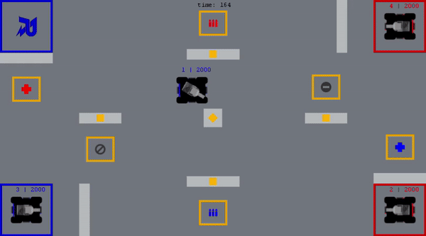

# UBC RoboMaster AI Challenge Simulator

RoboMaster AI Challenge Simulator (RMAICS), is a 2D simulation environment designed for the [ICRA 2021 RoboMaster AI Challenge](https://www.robomaster.com/en-US/robo/icra).
 Its main function is to provide a simulation environment for intelligent decision-making groups to train neural networks.
 

## 1. Dependencies

* numpy
* [pygame](https://www.pygame.org/) for visualization
* [networkx](https://networkx.org/) for waypoint navigation

## 2. User Guides

The simulation consists of two levels:
> The high-level package class: `rmaics`  
> The low-level implementation: `kernel`

For training, a neural network interfaces with `rmaics`.
The `get_observation` and `get_reward` functions need to be customized. 

The following manuals are provided for further information.
* High-level training interface in `rmaics.py`: [rmaics.md]()
* Low-level simulation implementation in `kernel.py`: [kernel.md](docs/kernel.md)
* Instructions for `record player`: [record_player.md]()
* Instructions for controls: [operation.md]()
* Parameter format: [params.md]()
* `kernel` development guide: [develop.md]()

